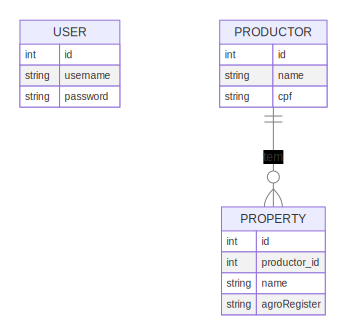

# Projeto de Cadastro de Produtores e Propriedades com Serviço de Autenticação

Este projeto é composto por dois serviços NestJS: um serviço para ações CRUD de produtores e propriedades, bem como emissão de relatório do Produtor, e serviço outro para autenticação. Ambos se comunicam via RabbitMQ. Abaixo está uma explicação detalhada de como o projeto funciona e como configurar o ambiente usando Docker. Após isso, as rotas poderão ser acessadas e testadas via navegador, utilizando o swagger.

## Visão Geral

### Arquitetura Orientada A microsserviços


### Fluxograma do projeto


### Diagrama de Entidade e Relacionamento


### Serviços

- **crud_service_api**: Serviço responsável pelo cadastro de produtores e propriedades.
- **auth_service_api**: Serviço responsável pela autenticação dos usuários.

### Banco de Dados

Cada serviço possui seu próprio banco de dados MySQL:

- **crud_service_db**: Banco de dados para o serviço de cadastro.
- **auth_service_db**: Banco de dados para o serviço de autenticação.

### Mensageria

- **RabbitMQ**: Utilizado para comunicação entre os serviços.

## Arquitetura do Docker

### Serviços

- **rabbitmq**: Container do RabbitMQ com a interface de gerenciamento habilitada.
- **crud_service_db**: Container MySQL para o serviço de cadastro.
- **crud_service_api**: Container do serviço de cadastro, construído a partir do diretório `./crudservice`.
- **auth_service_db**: Container MySQL para o serviço de autenticação.
- **auth_service_api**: Container do serviço de autenticação, construído a partir do diretório `./authservice`.

### Redes

- **auth-network**: Rede dedicada ao serviço de autenticação.
- **crud-network**: Rede dedicada ao serviço de cadastro.

## Configuração e Execução

### Pré-requisitos

- Docker e Docker Compose instalados.

### Passo a Passo

1. **Clone o repositório**:
   ```bash
   git clone <URL_DO_REPOSITORIO>
   cd <NOME_DO_REPOSITORIO>
    ```
2. **Estrutura de Diretórios:**
Certifique-se de que os diretórios *./crudservice* e *./authservice* contêm os arquivos necessários para construir as imagens Docker, incluindo os Dockerfiles e o código fonte.

3. **Iniciar os Contêineres:**
    ```bash
    docker-compose up --build
    ```


isso irá

- Construir as imagens dos serviços **crud_service_api** e **auth_service_api**.
- Iniciar os bancos de dados **MySQL** e o **RabbitMQ**.
- Popular os bancos de dados com as SEED's
- Configurar a comunicação entre os serviços via **RabbitMQ**.

### Detalhes dos Serviços
RabbitMQ
- Interface de gerenciamento disponível em http://localhost:15672
- Porta de comunicação: 5672

Serviço de Cadastro (crud_service_api)

- Interface de acesso das rotas SWAGGER em http://localhost:3001/api
- Porta de comunicação: 3001
- Dependências:
    - crud_service_db: Banco de dados MySQL.
    - rabbitmq: Para mensageria.
- Volume:
    - ./crudservice/src mapeado para /app/src
    - ./crudservice/prisma mapeado para /app/prisma

Serviço de Autenticação (auth_service_api)

- Interface de acesso das rotas SWAGGER em http://localhost:3002/api
- Porta de comunicação: 3002
- Dependências:
    - auth_service_db: Banco de dados MySQL.
    - rabbitmq: Para mensageria.
- Volume:
    - ./authservice/src mapeado para /app/src
    - ./authservice/prisma mapeado para /app/prisma

### Healthchecks
Cada serviço possui healthchecks configurados para garantir que os contêineres estão funcionando corretamente:

- RabbitMQ e MySQL: Verificações periódicas de conectividade e estado.
- Serviços NestJS: Dependem dos bancos de dados e do RabbitMQ para iniciar corretamente.

### Conclusão
Este README fornece uma visão geral e um guia de configuração para o projeto de cadastro de produtores e propriedades com um serviço de autenticação. Com a configuração do Docker Compose, é possível iniciar rapidamente o ambiente de desenvolvimento, garantindo a comunicação eficiente entre os serviços através do RabbitMQ.
